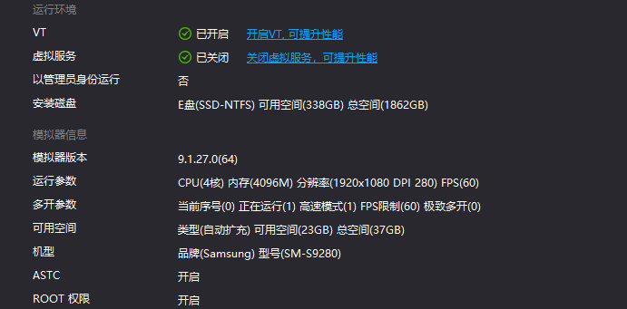

# auto-gakumasu
My daily reward tool for 学園アイドルマスター / 学园偶像大师

This scripts will start emulator, start game and finish all daily tasks and get rewards automatically.

## How to use

### Dependencies

* LDPlayer Vulkan (雷电加速器Vulkan版)
  * https://www.ldmnq.com/
  * 
* Kuyo
  * https://kuyo.cc/

### Run

```bash
git clone git@github.com:YXHXianYu/auto-gakumasu.git
cd auto-gakumasu

cargo run
```

### Run by Windows任务计划程序


